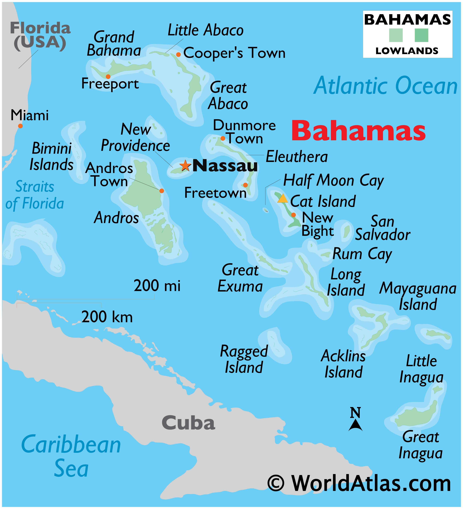

```{r setup, include=FALSE}
knitr::opts_chunk$set(echo = TRUE)
library(ggplot2)
bahamas_gdp <- read.csv("bahamas_gdp.csv")
bahamas_tourism <- read.csv("bahamas_visitors.csv")
caribbean_population <- read.csv("carribean_population.csv")
cruise_df <- read.csv("cruise_visitors_bahamas_1989_2023.csv")
```

# The Bahamas


## About The Bahamas  
The Bahamas is an archipelago made up of around **700 islands and cays**, with the most prominent inhabited islands being New Providence (home to the capial city Nassau), Grand Bahama, Abaco, Eleuthera, Exuma, Andros, Cat Island, Bimini, Long Island, and Inagua.  
While only about 30 of these islands are inhabited, the majority of the population resides on New Providence and Grand Bahama.

## Map of The Bahamas

{width=70%}

## Flag

{width=50%}  
*Flag of The Bahamas*

---

# Population

The population of the Bahamas as of 2019 is **412,624**, making it the **8th most populous island nation** in the Caribbean. (Haiti, The DOminican Republic, and Cuba are the top three)  

This graph compares the population of the Bahamas to the six other popular islands in the Carribean.

```{r population-plot, echo=FALSE}
library(ggplot2)
library(dplyr)

# Caribbean Population Data
caribbean_population <- data.frame(
  Country = c(
    "Jamaica", "Trinidad and Tobago", "Bahamas", "United States Virgin Islands", 
    "Cayman Islands", "Dominica", "Saint Kitts and Nevis", "Turks and Caicos Islands", 
    "Sint Maarten", "British Virgin Islands", "Caribbean Netherlands", "Saint Martin", 
    "Anguilla", "Saint Barthélemy", "Montserrat"
  ),
  Population = c(
    2839175, 1507782, 401283, 84905, 
    74457, 66205, 46843, 46535, 
    43350, 39471, 30675, 26129, 
    14598, 11258, 4389
  )
)

# Top 6 countries by population
top_population <- caribbean_population %>% 
  arrange(desc(Population)) %>% 
  head(6)

ggplot(top_population, aes(x = reorder(Country, -Population), y = Population, fill = Country)) +
  geom_bar(stat = "identity") +
  labs(
    title = "Population of Top Caribbean Islands",
    x = "Country",
    y = "Population"
  ) +
  theme_minimal() +
  theme(axis.text.x = element_text(angle = 45, hjust = 1))
```

---

# GDP

## GDP Summary  
The Bahamas' GDP reached an all-time high of **$14.34 billion** in 2023, supported by consistent annual growth of about **4% since 1996**.  
In 2022, the GDP per capita was **$30,995**, reflecting strong economic performance. Tourism remains the backbone of the economy, contributing **70%** of GDP, followed by financial services at **20%**.  

## GDP of Bahamas (1960-2020)

```{r gdp-plot, echo=FALSE}
bahamas_gdp <- read.csv("bahamas_gdp.csv")
bahamas_gdp$gdp_billions <- bahamas_gdp$gdp / 1e9

ggplot(bahamas_gdp, aes(x = year, y = gdp_billions)) +
  geom_line(color = "blue", size = 1.2) +
  geom_point(color = "darkblue", size = 2) +
  labs(
    title = "GDP of Bahamas (1960-2020)",
    subtitle = "GDP in Billion USD",
    x = "Year",
    y = "GDP (Billion USD)"
  ) +
  theme_minimal()
```
You can see from this graph that the economy for the Bahamas has been steadily growing since around 1980, with a big spike in the mid 1990's. This spike is likely due to the mass influx in tourism and cruise ships popularity around that time. 

## GDP Rank of Bahamas (1960-2020)

```{r gdp-rank-plot, echo=FALSE}
ggplot(bahamas_gdp, aes(x = year, y = rank)) +
  geom_line(color = "green", size = 1.2) +
  geom_point(color = "darkgreen", size = 2) +
  labs(
    title = "GDP Rank of Bahamas (1960-2020)",
    subtitle = "Rank in world GDP",
    x = "Year",
    y = "Rank"
  ) +
  scale_y_reverse() +
  theme_minimal()
```
Contrary to the total GDP, The Bahamas GDP world rank has been DECREASING over time, although it has began an upward trend around 5 years ago. 
---

# Tourism

The Bahamas is a major tourist destination known for its beaches, marine life, and cultural experiences. The majority of tourists arrive on **cruise ships**, and **97%** come from the Americas.

The Bahamas is a paradise of natural wonders and pristine beaches with numerous activities for tourists. All the islands have famous beaches known for their pinkish white sand and crystal clear waters. The Exumas provide amazing snorkeling and diving, showcasing vibrant coral reefs and diverse marine life (you can even swim with pigs!). A trip to Blue Lagoon Island offers unique opportunities to swim with dolphins, interact with sea lions and stingrays, or snorkel among nurse sharks. The Bahamas also has many reorts, water parks and casinos. Dean's Blue Hole is also located here, the world’s deepest blue hole, a breathtaking natural marvel located on Long Island.

With all of those options, tourism is the #1 contributor to the Bahamas economy and is an essential resource for the country. Cruise ships provide an especially important means of transport for these tourists, as many trips feature day stops on the island. 

{width=60%}

## Tourism Visitors to The Bahamas (2000-2023)

```{r tourism-plot, echo=FALSE}
bahamas_tourism <- read.csv("bahamas_visitors.csv")

ggplot(bahamas_tourism, aes(x = as.numeric(Year))) +
  geom_line(aes(y = as.numeric(Stopover.Visitors), color = "Stopover Visitors"), size = 1.2) +
  geom_line(aes(y = as.numeric(Cruise.Visitors), color = "Cruise Visitors"), size = 1.2) +
  labs(
    title = "Tourism Visitors to The Bahamas (2000-2023)",
    subtitle = "Stopover vs Cruise Visitors",
    x = "Year",
    y = "Number of Visitors"
  ) +
  theme_minimal()
```
You can see that cruise ships visitors make up the vast majority of tourists in the Bahamas and is by far the most common method of visiting. While there are amazing hotels for stopover (overnight) visits, the number of those tourists by year seems to stay pretty constant, while cruise shp visitors keep rising. This could be due to the lower cost of cruise ships relative to a reort vacation as inflation has increased drastically over the last several years. This could also be due to the fact that many of the resorts being build on The Bahamas recently are high end, luxury resorts, which don't appeal much to the majority of visitors. 
---

# Crime

Despite the high tourism numbers, crime remains a major problem on the Bahamian Islands. The Bahamas faces significant crime challenges, particularly in downtown Nassau and Freeport, with violent crimes such as armed robberies, burglaries, sexual assaults, and theft being most common. The country also struggles with gun trafficking, as firearms and ammunition are often smuggled in from U.S. manufacturers. Sexual assaults, including incidents on beaches, in hotels, and casinos, are concerning, with drink spiking sometimes being a prelude to these crimes. Additionally, gender-based violence remains a human rights issue, though the government is taking steps to address it.

While gang violence is mostly among Bahamian natives, there are reported crimes against tourists as well wi the cruise ship terminals. However the government is actively taking measures to lower these instances, as tourism provides a significant role in the country's economy (as discussed before) and continues to rise to record highs. 

